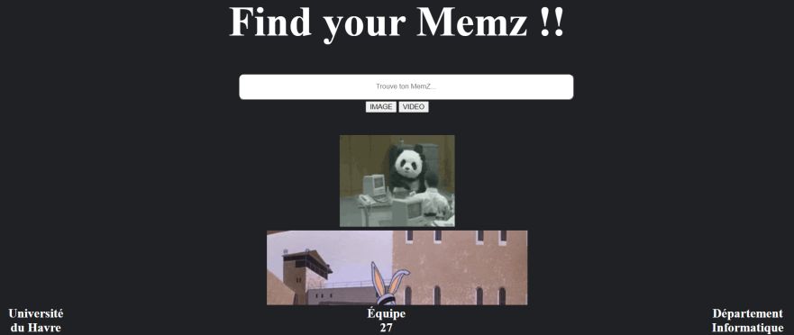
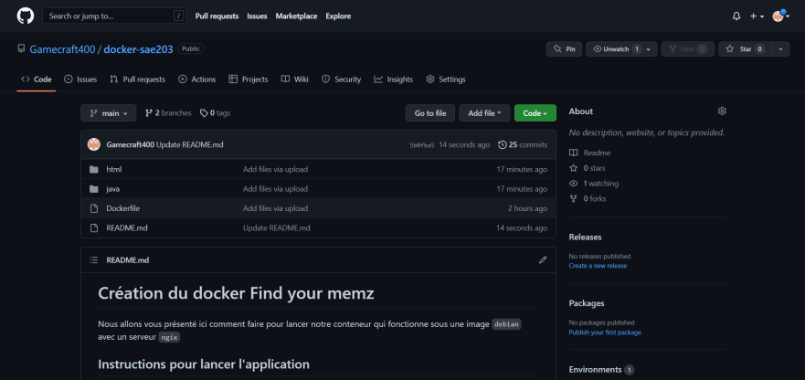

#  **Sae 2.03 - Compte Rendu - Équipe 27**

# Notre site web
Nous avons décidés de réalisé un site permatant de trouvé un [meme](https://en.wikipedia.org/wiki/Meme).

Un meme est une image, une vidéo, un texte, etc., typiquement de nature humoristique, qui est copié et diffusé rapidement par les internautes, souvent avec de légères variations.

A fin de les recherchers, nous avons implémentés une barre de recherche en JavaScript.
```JavaScript
// JavaScript code

function search_memz() {
    let input = document.getElementById('searchbar').value;
    input=input.toLowerCase();
    let x = document.getElementsByClassName('memz');
      
    for (i = 0; i < x.length; i++) { 
        if (!x[i].innerHTML.toLowerCase().includes(input)) {
            x[i].style.display="none";
        }
        else {
            x[i].style.display="list-item";                 
        }
    }
}
```
On peut aussi trier le format du meme pour afficher uniquement les images ou les vidéos.

## Voici le rendu final :



Le lien suivant vous permetra d'accéder à notre site internet via le lien http://di-docker:667/

# Notre GitHub
Nous avons travailler sur un GitHub crée par William LeFort


# Notre Docker

Nous allons vous présenté ici comment faire pour lancer notre conteneur qui fonctionne sous une image ```debian``` avec un serveur ```ngix```

## Instructions pour lancer l'application :

- Vérifiez si docker est installé :
```shell
docker --version
```

- Cloner le référentiel :
 ```shell
git clone git@github.com:Gamecraft400/docker-sae203.git
```

- Aller au référentiel :
```shell
cd docker-sae203
```

- Construisez l'image décrite dans dockerfile avec docker build : 
```shell
docker build -t img-find-your-memz .
```

- Lancer le serveur web :
```shell
docker run --name findyourmemz -d -p 667:80 img-find-your-memz
```
- Vérifier que le conteneur associé est actif :
```shell
docker ps
```

- Finalement, arrêtez le conteneur avec la commande suivante (les dernières chiffres sont le code de hachage affiché par docker ps):
```shell
docker stop findyourmemz
```

- Encore, si on souhaite supprimer le conteneur, on peut taper :
```shell
docker rm findyourmemz
```

### Ce projet à était réaliser lors de la SAÉ 2.03 par l'équipe 27 composée de William Lefort, Malo Rihet et Gaëtan Kermarrec.
